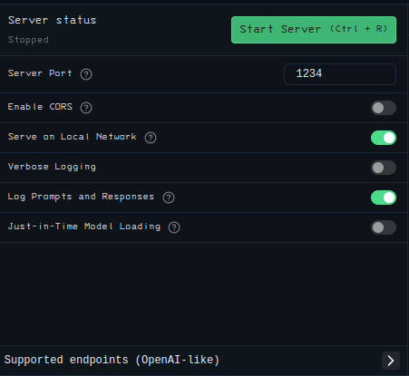

# [Chat Client](https://chat.depo.com.ru/)
The main idea is to help web developers efficently work with frontend on theres projects. Using community LLM's and providing better user expirience during UI development Chat Client is good alternative to all familiar services, but free and local.

---

## Contents

- <a href="#goals">Goals</a>
- <a href="#tech_stack">Tech Stack</a>
- <a href="#how_to_run">How to run</a>

---

## Goals
<div id="goals"></div>

- [x] Basic chat
- [ ] Page preview
- [ ] Github autocommit

---

## Tech Stack
<div id="tech_stack"></div>

<details>
    <summary>Backend</summary>
        <div>
            <strong>App: </strong>
            Fastapi, uvicorn, pydantic-settings
        </div>
        <div>
            <strong>Database: </strong>
            SQLAlchemy, alembic
        </div>
        <div>
            <strong>Tests: </strong>
            Pytest, httpx
        </div>
</details>

<details>
    <summary>Lms</summary>
        <div>
            <strong>App: </strong>
            Express, Socket.io
        </div>
        <div>
            <strong>Services: </strong>
            Axios, LmstudioSDK
        </div>
</details>

<details>
    <summary>Frontend</summary>
        <div>
            <strong>App: </strong>
            React, React-router-dom, Vite, Redux
        </div>
        <div>
            <strong>Services: </strong>
            Socket.io, RTK
        </div>
        <div>
            <strong>Styles: </strong>
            Tailwind, Highlight.js, React-lowlight, Marked-React
        </div>
</details>

## How to run
<div id="how_to_run"></div>

1. Download [LM Studio](https://lmstudio.ai/download)
2. Run server with this options 

3. To run dev: ```./manage.sh run dev -d -m -b```
4. To get a description ```./manage.sh --help```
